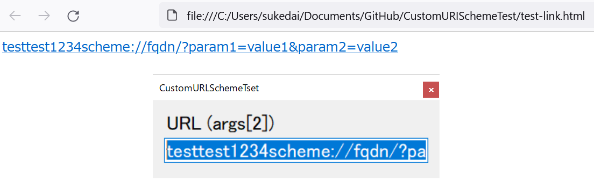

# CustomURISchemeTest



#### custom_uri_scheme.reg
```
[HKEY_CLASSES_ROOT\testtest1234scheme]
"URL Protocol"=""

[HKEY_CLASSES_ROOT\testtest1234scheme\shell\open\command]
@="\"C:\\work\\CustomURISchemeTest\\bin\\Debug\\CustomURISchemeTest.exe\" process \"%1\""
```

## Copyright and license
Copyright (c) 2022 yoggy

Released under the [MIT license](LICENSE.txt)